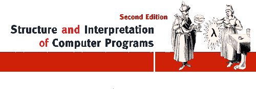

<div align="center">
  
  <!-- </hr> -->
  <!-- <h2>Solutions</h2> -->
</div>
In current repo presented solutions for book written by Harold Abelson, Gerald Jay Sussman and Julie Sussman.

### Structure

One folder for one chapter.
In every folder you can find file called `code.scm`. This is the main file to run code for this chapter.

To run code for chapter N enter following:
```bash
rlwrap scheme
1]=> (load "chapterN/code.scm")
```

If code ran successfully, then you can see something like that:

```
-----------------------------
Chapter loading successfull.
-----------------------------
```
